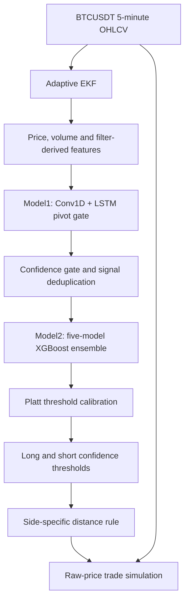

# BTC5M-two-stage-ML-pipeline_2

A research pipeline for short-horizon direction on **BTCUSDT 5-minute candles**. A first model identifies potential turning points; a second estimates which direction the price will resolve. Confidence thresholds determine when to issue a long or short signal and when to stay out.

The idea is to make selectivity part of the model. Instead of asking for a direction on every candle, I first look for a smaller set of potentially informative events. The directional model then combines price, volume, filter-derived signals, and the first model's confidence to evaluate those events.

This version uses a **Conv1D + LSTM pivot gate**, followed by a **five-model XGBoost ensemble** and **Platt probability calibration**. An adaptive Extended Kalman Filter (EKF) supplies the preprocessing and some of the features. **The EKF implementation remains proprietary.**

The saved results show directional ranking above chance and positive gross simulated returns. They also show that confidence thresholds matter: more selective settings often produce higher average returns per trade. These are research findings, with the evaluation and execution limits explained below.

## Release contents

The figures below are figures extracted from the notebooks. Metrics are reported from those saved runs; this README does not represent a new execution of the experiments.

**This initial release is a research code and results release, not a self-contained runnable model distribution.** It does not bundle the private EKF, market data, trained weights, or saved configuration and calibration artifacts.

## How the pipeline works

### The proprietary filter

The adaptive EKF is intended to reduce short-term noise in the OHLC series while retaining the broader price path. It also supplies velocity, volatility, uncertainty, and innovation signals: information about the estimated market state and how much new observations differ from the filter's expectations.

*The left panels show the filtered series; the right panels show the raw series over the same interval. This illustrates the preprocessing effect. It does not, by itself, establish a predictive benefit from filtering.*

The intended operation is forward-only, using observations available at each candle. The private implementation is excluded, so readers cannot independently audit that part from this release. Downstream models use its outputs, while simulated entries and exits use **raw prices**, rather than treating filtered prices as executable quotes.

### M1: identifying potential pivots

M1 learns retrospective labels for local highs and lows in the filtered series. Extrema are identified with a 90-bar neighborhood on each side, with a one-candle tolerance around each pivot. This expands the positive-label share from approximately **0.78% to 2.33%** of eligible candles across the dataset.

*Red points mark the training targets around an identified high or low. These are hindsight labels, not signals that were already known at the marked time. The network predicts them from the available trailing history.*

The network receives **60 candles × 50 features**: five hours of price structure, momentum, volatility, volume, raw-versus-filtered differences, and filter-derived information. Three causal, dilated Conv1D layers feed an LSTM with 32 units and a small dense classifier. Training uses class weighting and selects the checkpoint by validation precision–recall AUC.

*Validation metrics fluctuate while training progresses, making checkpoint selection important. Recall in this training-history chart uses the training metric's default classification cutoff; the evaluation below uses the explicit 0.85 cutoff.*

At the **0.85 evaluation threshold**, the saved classification reports give:

| M1 pivot-class metric | Validation | Test |
|---|---:|---:|
| Precision | 0.17 | 0.12 |
| Recall | 0.60 | 0.54 |
| F1 | 0.27 | 0.20 |
| Evaluated candles | 18,026 | 115,051 |

*The validation distribution concentrates strongly near low scores, while a smaller high-score group supplies candidate events.*

*The test results retain approximately 54% of labelled pivot candles, but also include many false positives. M1 enriches the candidate set; it is not an accurate standalone turning-point detector. Overall accuracy is less informative here because the positive class is rare.*

For the **handoff to M2**, the training notebook explicitly overrides the gate to **0.88**. Retained signals must be more than three 5-minute bars apart. Across the full development dataset, this leaves **14,726 candidate events**, approximately **3.04% of candles**. That percentage includes the earlier training periods and is not a test-only result.

*Red markers are retained candidates; grey markers are nearby activations removed by deduplication. The 0.88 title reflects the M2 handoff setting, distinct from the 0.85 M1 evaluation cutoff. Inference reads its gate from the saved policy file.*

### M2: predicting direction at the retained events

Each candidate receives a triple-barrier label: which price barrier is reached first, **4 × ATR above or below the signal close**, within **120 bars**, or ten hours. ATR uses a 100-bar rolling window. Training targets use the filtered price path; raw-price labels are also calculated for comparison. Filtered-label timeouts, missing future windows, and ambiguous same-bar barrier hits are excluded from directional classification.

Across the full dataset, **13,926 events** have usable filtered-price labels. Among **13,738 events resolved on both price paths**, **1,510 disagree**, or approximately **11.0%**. This measures label mismatch; it is not a formula for converting classification accuracy into trading win rate.

M2 uses **54 base features**, including M1's confidence and recent signal behavior. Each 60-bar window becomes 216 tabular inputs: the latest feature values, changes over five and twenty bars, and variability across the window. Five XGBoost models trained with different seeds produce probabilities that are averaged before calibration.

## Evaluation design

The saved training dataset contains **484,270 candles**, from **1 February 2022 through 9 September 2026**, in UTC. Earlier history is allocated chronologically to M1 training, M1 validation, M2 training, and M2 validation, in proportions of 30%, 5%, 40%, and 25%. The final approximately 400 days form the model test period:

**5 August 2025, 23:55 UTC → 9 September 2026, 23:55 UTC.**

The code removes observations near split boundaries to protect future-dependent labels and separates stages with temporal gaps. Feature construction uses trailing information, and sequence checks reject windows spanning missing candles. M2 is trained on a later period than M1, so its training inputs come from a gate already fitted on earlier history.

Within M2 validation, separate chronological blocks serve early stopping, calibration, and threshold selection. The saved sample counts are:

| M2 role | Events |
|---|---:|
| Training | 4,369 |
| Early stopping | 1,047 |
| Calibration | 798 |
| Threshold selection | 876 |
| Test | 3,501 |

This is one chronological experiment, not a repeated walk-forward study. Model fitting and confidence-threshold selection are separated from the final test in the code. **The additional distance rule was developed using data that includes the test period**, so strategy results incorporating it are development evidence rather than an untouched test of the complete policy.

### Directional ranking

| Metric | Validation | Test |
|---|---:|---:|
| Mean individual-model ROC-AUC | 0.6383 | 0.6600 |
| Ensemble ROC-AUC | **0.6388** | **0.6623** |

*The left panel compares training, validation, and test ranking, with stars marking the ensemble. The right panel shows that the seeds stop at different numbers of boosting rounds. The ensemble gives a modest improvement over the average individual model.*

A test AUC of 0.6623 supports useful separation between the two labelled directions in this sample. It does not imply that every event has a tradable edge.

### Probability calibration

Platt calibration fits a logistic transformation of the ensemble's log-odds on the dedicated calibration block. Its positive slope preserves the ranking while changing the probability scale.

| Later-validation metric | Raw | Platt |
|---|---:|---:|
| Brier score, lower is better | 0.2383 | 0.2400 |
| Log loss, lower is better | 0.6690 | 0.6719 |

*Calibration spreads the probabilities over a wider range, but both reported scores become slightly worse on the later block. I therefore treat calibration as part of the saved pipeline, not as a demonstrated improvement in probability quality.*

### Selecting long and short thresholds

The selection block chooses a pair of thresholds by maximizing a conservative lower confidence bound on the weaker side's precision, subject to minimum sample sizes, event coverage, and trading-frequency constraints. This favors evidence on both sides rather than a high precision estimate supported by only a few events.

*The selected pair is highlighted. The bars display observed worst-side precision and frequency; the selection criterion itself uses a Wilson lower bound that penalizes small samples.*

The saved directional thresholds are **long ≥ 0.7178** and **short ≤ 0.2497**, rounded here to four decimals. Scores between them generate no directional trade.

| Selected-event metric | Validation selection block | Test |
|---|---:|---:|
| Events selected | 133 | 542 |
| Long / short calls | 88 / 45 | 326 / 216 |
| Accuracy against filtered labels | 78.95% | **82.10%** |
| Selected events per calendar day | 1.37 | 1.35 |

The 542 selected test events represent approximately **15.5% of the 3,501 evaluated M2 test events**. Test long precision is approximately **81.9%** and short precision **82.4%**, calculated from the displayed confusion matrix. These results concern selected, resolved filtered-price labels; **82.10% is not the raw-price trading win rate**.

## Raw-price simulations

### Distance-rule comparison in the training notebook

The additional rule considers the distance from entry to the existing raw-price barrier. A short is skipped when **4 × ATR_raw / entry_price** exceeds **0.70%**. Longs have no distance cap. The rule rejects an event; it does not shrink that event's stop or target.

| Gross simulation metric | No distance cap | Side-specific cap |
|---|---:|---:|
| Trades | 542 | 474 |
| Win rate | 58.487% | 60.338% |
| Average return per trade | +0.067% | +0.100% |
| Sum of fixed-notional trade returns | +36.183% | +47.397% |
| Cumulative-return drawdown | −13.123 percentage points | −4.470 percentage points |

*The upper panel shows cumulative trade returns ordered by entry. The lower panels show the corresponding decline from the running peak and the return distribution of retained versus skipped trades. “Unfiltered” in the legend means without the distance cap; both policies still use EKF-derived model features.*

The improvement is substantial in this sample, but the cap was developed with access to this period. In addition, these trades originate from the resolved-label classification subset. This comparison is useful development evidence, not an independent estimate of the finished strategy's future performance.

### Inference-notebook results

The saved inference data spans **6 August 2025 through 24 September 2026**, with 119,520 candles. Although its configured end date is later, the saved data output ends on 24 September. The run produces 3,810 directional predictions and **511 trades** after the saved policy's confidence thresholds and distance rule.

| Saved inference metric | Value |
|---|---:|
| Trades | **511** |
| Win rate | **59.10%** |
| Average gross return per trade | **+0.0761%**, or **7.61 bps** |
| Sum of fixed-notional trade returns | **+38.90%** |
| Maximum realized-equity drawdown | **−5.78%** |
| Annualized per-trade Sharpe | **2.86** |

*The equity index starts at 100 and adds each trade's return when that trade exits. Drawdown is the percentage decline from its running peak. These definitions differ from the entry-ordered percentage-point drawdown in the preceding figure.*

Both simulations assume entry at the signal candle's **raw close**, symmetric stops and targets at **4 × raw ATR**, and a **120-bar** holding limit. If both barriers are touched in one candle, the stop takes priority. Unresolved positions exit at the time limit, or the end of available data. Positions can overlap and use equal fixed notional. **Fees are zero; slippage and funding are excluded.**

The return total is an additive fixed-notional result, not a compounded account return under an enforced capital budget. The curve omits unrealized gains and losses on open positions, so its drawdown is not full mark-to-market risk. The Sharpe annualizes individual trade returns and does not account for dependence between overlapping positions.

The inference period substantially overlaps the model test and distance-rule development history. It is an extended historical simulation, not an independent forward test. Differences in dates, event eligibility, and timeout handling also prevent a direct one-for-one comparison with the training notebook's trade counts.

## Threshold sensitivity and fees

**Average return per trade depends on the confidence thresholds. Fee sensitivity therefore depends on the chosen operating point, rather than being a single fixed property of the model.**

For an upward-direction probability, stricter confidence means raising the long threshold and lowering the short threshold. The saved sweep applies these alternatives to the same inference history with the distance rule enabled:

*Moving right raises the long threshold; moving down tightens the short threshold. Each cell includes its trade count, which is essential when comparing the stronger-looking results.*

Examples from the displayed sweep, using its rounded values:

| Long ≥ | Short ≤ | Trades | Average gross return | Win rate |
|---:|---:|---:|---:|---:|
| 0.55 | 0.45 | 2,403 | +0.018% / 1.8 bps | 52.1% |
| 0.75 | 0.25 | 400 | +0.097% / 9.7 bps | 60.0% |
| 0.80 | 0.20 | 194 | +0.128% / 12.8 bps | 62.4% |
| 0.85 | 0.20 | 64 | +0.242% / 24.2 bps | 73.4% |

The broad pattern is encouraging: demanding stronger confidence often increases average gross return and win rate while reducing trade frequency. **This is evidence consistent with predictive ranking power in the evaluated sample**: the scores help distinguish more promising events from weaker ones, rather than merely assigning directions.

The relationship is not uniformly monotonic. Some stricter settings reduce average return, tightening only one side changes the long/short mix, and the most selective cells contain far fewer trades. Identical cells at the highest long thresholds reflect unchanged selections, not additional independent confirmations. The 64-trade result deserves more uncertainty than the broader samples.

For a fixed trade set and a constant total round-trip cost, the direct arithmetic is:

**Average net return in bps ≈ average gross return in bps − total cost in bps.**

At the saved policy's 7.61 bps gross average, a hypothetical 5 bps total cost leaves approximately **2.61 bps per trade**; 10 bps makes the average approximately **−2.39 bps**.

Stricter thresholds can therefore provide more room to absorb costs, but this trades frequency for selectivity and does not ensure higher total profit. The heatmap is descriptive: it does not change the saved thresholds. Selecting its best cell after observing these results would require a new untouched evaluation period before claiming a validated improvement.

